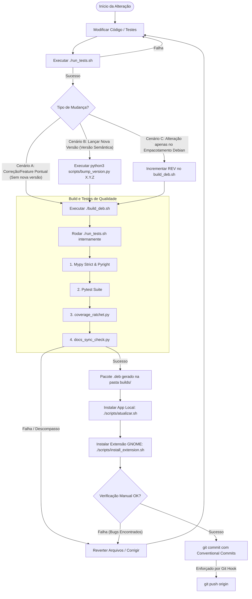

# 🚀 Pipeline de Desenvolvimento, Versionamento e Empacotamento

Este documento é a **Fonte Única de Verdade** para todo o fluxo de desenvolvimento, testes, versionamento e build do projeto `openrgb`.

---

## 🏗️ Árvore de Decisão do Pipeline



---

## 🏁 Roteiro de Cenários de Lançamento

### Cenário A: Correção ou Feature Pontual (Sem nova versão)
Use para alterações incrementais ou refatorações que não necessitam de alteração na versão semântica do projeto.
1. Desenvolva o código e escreva os testes necessários.
2. Execute `./run_tests.sh` localmente para validação prévia rápida.
3. Execute `./build_deb.sh` para testar o empacotamento completo.
4. Execute `bash scripts/atualizar.sh` para instalar localmente.
5. Verifique manualmente se o comportamento do sistema está estável.
6. Se falhar, limpe com `git checkout -- . && rm -rf builds/*`.
7. Se passar, envie o commit seguindo Conventional Commits.

### Cenário B: Lançar Nova Versão Semântica (Bump X.Y.Z)
Use quando for realizar um lançamento de nova versão.
1. Rode `python3 scripts/bump_version.py X.Y.Z` (onde `X.Y.Z` é a nova versão pretendida).
2. Execute `./build_deb.sh`. Isso executará todos os testes e a sincronia de versão nos 7 arquivos críticos (verificados pelo `docs_sync_check.py`).
3. Execute `bash scripts/atualizar.sh` e `bash scripts/install_extension.sh` para testes locais.
4. Caso ocorra erro ou decida abortar, execute o rollback do Cenário B:
   ```bash
   git checkout -- pyproject.toml docs/stack.md docs/TESTS.md src/rgb_control/main.py packaging/rgb.sh README.md scripts/atualizar.sh
   rm -rf builds/*
   ```
5. Commit e dê push na branch de desenvolvimento.

### Cenário C: Ajustes no Empacotamento Debian (REV Increment)
Use quando apenas os arquivos de infraestrutura Debian (como arquivos do systemd, scripts de pós-instalação ou o próprio script de build) forem alterados, sem mudança no código do aplicativo.
1. Abra `build_deb.sh` e altere a variável `REV="..."` (ex: incremente de `REV="1"` para `REV="2"`).
2. Execute `./build_deb.sh`. O script atualizará automaticamente as referências a esse pacote no `README.md`.
3. Teste o pacote localmente usando `bash scripts/atualizar.sh`.
4. Caso ocorra erro ou queira abortar, execute o rollback do Cenário C:
   ```bash
   git checkout -- build_deb.sh README.md
   rm -rf builds/*
   ```

---

## 📦 Governança e Hooks Locais

O repositório possui mecanismos automáticos locais para garantir a conformidade dos commits e a integridade da branch `main`:
1. **Commit-Msg Hook (`packaging/git-hooks/commit-msg`)**: Verifica se as mensagens de commit seguem a convenção Conventional Commits (ex: `feat(core): ...`, `fix(gui): ...`).
2. **Pre-Push Hook (`packaging/git-hooks/pre-push`)**: Bloqueia pushes locais diretos para a branch `main`.
3. **Instalação**: Todos os desenvolvedores devem instalar os hooks executando o script de onboarding uma única vez após clonar o repositório:
   ```bash
   bash scripts/setup_dev.sh
   ```
4. **Bypass Emergencial**: Se for o administrador do repositório realizando um release oficial aprovado, você pode bypassar a proteção local executando:
   ```bash
   ALLOW_MAIN_PUSH=1 git push origin main
   ```

> [!IMPORTANT]
> A proteção definitiva contra push na branch `main` deve ser ativada no servidor (ex: GitHub / GitLab Settings ➔ Branches ➔ Protect main), exigindo aprovação de Pull Request e testes de qualidade antes do merge.

---

## 🛠️ Catálogo de Scripts do Pipeline

Abaixo estão todos os arquivos associados ao pipeline de desenvolvimento. Todos os scripts devem conter o cabeçalho canônico `# Pipeline Reference: .agents/workflows/pipeline.md` (ou correspondente em markdown) para auditoria pelo teste de integridade.

### `pipeline_run.sh`
- **Caminho**: `scripts/pipeline_run.sh`
- **Propósito**: Wrapper interativo em linha de comando que guia o operador na escolha do cenário e executa as validações e compilações automáticas de forma interativa.
- **Gatilho / Quando usar**: Executado manualmente pelo desenvolvedor na raiz do repositório sempre que for realizar uma alteração.
- **Efeitos Colaterais / Cascata**: Dispara `bump_version.py`, `run_tests.sh` e `build_deb.sh` conforme o cenário escolhido.
- **Dependências / Requisitos**: Deve ser rodado a partir da raiz do repositório.

### `setup_dev.sh`
- **Caminho**: `scripts/setup_dev.sh`
- **Propósito**: Script de onboarding que inicializa o ambiente de desenvolvimento local.
- **Gatilho / Quando usar**: Executado manualmente uma única vez após clonar o repositório.
- **Efeitos Colaterais / Cascata**: Copia hooks de `packaging/git-hooks/` para `.git/hooks/` e aplica permissões de execução.
- **Dependências / Requisitos**: Requer diretório `.git` ativo localmente.

### `bump_version.py`
- **Caminho**: `scripts/bump_version.py`
- **Propósito**: Automatiza o incremento de versão do projeto nos arquivos de documentação e código fonte.
- **Gatilho / Quando usar**: Chamado manualmente ou via `pipeline_run.sh` durante o Cenário B.
- **Efeitos Colaterais / Cascata**: Modifica 7 arquivos contendo a versão do sistema (incluindo o comentário do `atualizar.sh`).
- **Dependências / Requisitos**: Requer Python 3 e argumento com a nova versão formato `X.Y.Z`.

### `docs_sync_check.py`
- **Caminho**: `scripts/docs_sync_check.py`
- **Propósito**: Audita o repositório garantindo que todos os arquivos que referenciam a versão exibam a mesma versão do `pyproject.toml`.
- **Gatilho / Quando usar**: Chamado automaticamente dentro de `run_tests.sh`.
- **Efeitos Colaterais / Cascata**: Ninguém (somente leitura). Retorna código de erro `1` em caso de descompasso de versão.
- **Dependências / Requisitos**: Python 3.

### `coverage_ratchet.py`
- **Caminho**: `scripts/coverage_ratchet.py`
- **Propósito**: Enforça que a cobertura de testes não diminua (Ratchet).
- **Gatilho / Quando usar**: Chamado automaticamente no fim do `run_tests.sh`.
- **Efeitos Colaterais / Cascata**: Atualiza o arquivo `.coverage_ratchet_threshold` se um novo pico de cobertura for alcançado. Retorna erro se houver regressão de coverage.
- **Dependências / Requisitos**: Requer arquivo `coverage.json` gerado pelo pytest.

### `atualizar.sh`
- **Caminho**: `scripts/atualizar.sh`
- **Propósito**: Instala o pacote `.deb` gerado no sistema operacional do desenvolvedor para testes locais.
- **Gatilho / Quando usar**: Executado manualmente após o build para testes funcionais do aplicativo.
- **Efeitos Colaterais / Cascata**: Reconstrói o pacote com `build_deb.sh` e executa instalação dpkg.
- **Dependências / Requisitos**: Requer privilégios de administrador (`sudo`). **Proibido em ambientes de CI**.

### `install_extension.sh`
- **Caminho**: `scripts/install_extension.sh`
- **Propósito**: Instala a extensão GNOME do projeto localmente na pasta do usuário para testes rápidos de interface.
- **Gatilho / Quando usar**: Executado pelo desenvolvedor para testar atalhos da barra de menu superior.
- **Efeitos Colaterais / Cascata**: Copia código GNOME para `~/.local/share/gnome-shell/extensions/`.
- **Dependências / Requisitos**: Comando `gnome-extensions` local.

### `linhas_tam.sh`
- **Caminho**: `scripts/linhas_tam.sh`
- **Propósito**: Script utilitário opcional de métricas de tamanho e linhas de código do repositório.
- **Gatilho / Quando usar**: Chamado opcionalmente pelo desenvolvedor para ver estatísticas de arquivos úteis.
- **Efeitos Colaterais / Cascata**: Ninguém.
- **Dependências / Requisitos**: Binários `find`, `stat`, `awk` do linux.

### `run_tests.sh`
- **Caminho**: `run_tests.sh`
- **Propósito**: Ponto central de validação de qualidade (Mypy, Pyright, Testes CLI, Pytest, Coverage Ratchet e Sync Check).
- **Gatilho / Quando usar**: Executado manualmente pelo desenvolvedor ou chamado por `build_deb.sh`.
- **Efeitos Colaterais / Cascata**: Executa em cascata todas as verificações de linter e testes.
- **Dependências / Requisitos**: Executado na raiz do projeto. Totalmente compatível com CI (não requer sudo).

### `build_deb.sh`
- **Caminho**: `build_deb.sh`
- **Propósito**: Compila a aplicação no formato de pacote Debian (.deb) pronto para instalação.
- **Gatilho / Quando usar**: Executado para preparar um pacote para teste ou release.
- **Efeitos Colaterais / Cascata**: Executa o `run_tests.sh` internamente e atualiza o `README.md` com o nome final do deb gerado. Limpa pacotes deb obsoletos na pasta `builds/`.
- **Dependências / Requisitos**: Comando `dpkg-deb` do sistema operacional. Totalmente compatível com CI.

### `packaging/git-hooks/commit-msg`
- **Caminho**: `packaging/git-hooks/commit-msg`
- **Propósito**: Template de hook local do git para validação de Conventional Commits.
- **Gatilho / Quando usar**: Copiado pelo `setup_dev.sh`. Disparado pelo git antes de finalizar a criação de qualquer commit local.
- **Efeitos Colaterais / Cascata**: Bloqueia commits fora do padrão.

### `packaging/git-hooks/pre-push`
- **Caminho**: `packaging/git-hooks/pre-push`
- **Propósito**: Template de hook local do git para evitar pushes diretos na branch `main`.
- **Gatilho / Quando usar**: Copiado pelo `setup_dev.sh`. Disparado pelo git antes de realizar o push para o repositório remoto.
- **Efeitos Colaterais / Cascata**: Bloqueia pushes para a branch `main`.
