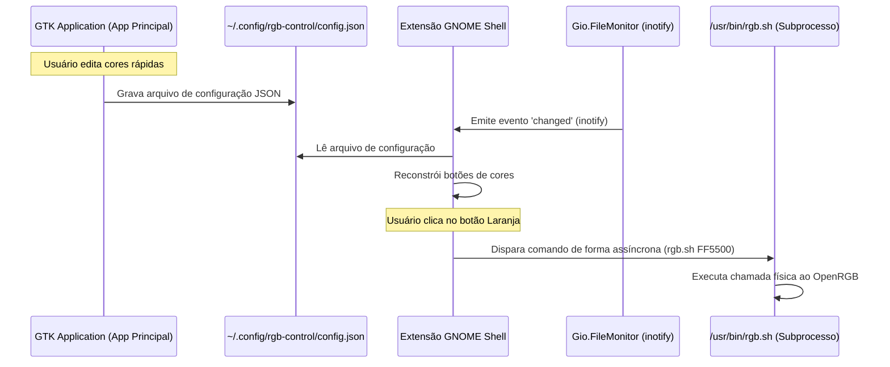

# Engenharia da Extensão GNOME Shell (rgb-control)

Este documento detalha o estudo de engenharia e a arquitetura técnica adotada pela extensão GNOME Shell (`rgb-control@sant.github.com`). A extensão foi projetada para oferecer controle rápido dos LEDs RGB de forma enxuta, resiliente e integrada ao desktop Linux moderno.

---

## 1. Visão Geral e Contexto de Execução

A extensão é compatível com as versões **GNOME Shell 45 a 48**, que exigem a utilização da API ESM (EcmaScript Modules) do GJS (GNOME JavaScript). Ela atua como um botão indicador (`PanelMenu.Button`) inserido na Área de Status superior do GNOME Shell.



---

## 2. Padrão Arquitetural: SSOT Sem Daemon (Zero-Polling)

Tradicionalmente, a sincronização de estados entre aplicativos de interface (GTK) e painéis de desktop é feita através de sockets IPC ativos (D-Bus, WebSockets) ou um daemon local em segundo plano.

Para otimizar o consumo de RAM e CPU, este projeto implementou o padrão **SSOT (Single Source of Truth) Baseado em Arquivo Monitorado**:

### Mecanismo de Sincronização
1. **Configuração Compartilhada:** O aplicativo GTK principal salva as três cores rápidas favoritas em `~/.config/rgb-control/config.json`.
2. **Monitoramento por Eventos (inotify):** Em vez de usar timers ou loops de leitura periódicos, a extensão monitora o diretório de configurações usando `Gio.FileMonitor`:
   ```javascript
   this._monitor = parentDir.monitor_directory(Gio.FileMonitorFlags.NONE, null);
   this._monitorId = this._monitor.connect('changed', (mon, changedFile, other, eventType) => {
       if (changedFile && changedFile.get_path() === this._configPath &&
           (eventType === Gio.FileMonitorEvent.CHANGED || eventType === Gio.FileMonitorEvent.CREATED || eventType === Gio.FileMonitorEvent.CHANGES_DONE_HINT)) {
           this._loadConfig();
       }
   });
   ```
3. **Vantagem:** O consumo de CPU para sincronia de estado é **0% em repouso**. A extensão recarrega as cores na memória instantaneamente apenas quando o arquivo é alterado fisicamente no disco.

---

## 3. Concorrência e Segurança de Interface (Non-Blocking UI)

O GNOME Shell executa toda a sua renderização de interface e lógica de extensões em uma **única thread principal**. Qualquer operação síncrona ou chamada de subprocesso bloqueante congela o Shell inteiro (causando quedas na taxa de quadros e travamentos perceptíveis).

Para evitar isso, a extensão executa comandos de shell de forma estritamente **assíncrona**:

```javascript
_runColorCommand(hex) {
    let cleanHex = hex.replace('#', '');
    try {
        let proc = new Gio.Subprocess({
            argv: ['/usr/bin/rgb.sh', cleanHex],
            flags: Gio.SubprocessFlags.STDOUT_PIPE | Gio.SubprocessFlags.STDERR_PIPE,
        });
        proc.init(null);
        proc.wait_async(null, (source, res) => {
            try {
                proc.wait_finish(res);
            } catch (e) {
                log('RGB Control Extension: rgb.sh failed: ' + e);
            }
        });
    } catch (e) {
        log('RGB Control Extension: Erro ao rodar rgb.sh: ' + e);
    }
}
```
* **`Gio.Subprocess` + `wait_async`:** Dispara a execução do script `rgb.sh` em segundo plano de forma nativa do GObject, resolvendo a promessa sem interferir na renderização de novos quadros do GNOME Shell.

---

## 4. UI/UX e Micro-Interações

A extensão não se limita a menus padrão do sistema; ela adiciona componentes customizados para melhorar a experiência visual:

* **Botões de Cores Circulares:** Renderiza os botões dinamicamente em formato esférico com bordas suaves e sombras diretamente via CSS inline e classes do arquivo `stylesheet.css`:
  ```javascript
  style: `background-color: ${hexColor}; width: 40px; height: 40px; border-radius: 20px; border: 2px solid rgba(255, 255, 255, 0.25); box-shadow: 0 2px 4px rgba(0, 0, 0, 0.2);`
  ```
* **Feedback de Hover:** Conecta sinais do Clutter (`enter-event` e `leave-event`) a cada botão para mudar dinamicamente o título do menu (ex: de `RGB Control` para `RGB Control (Laranja)`), orientando o usuário sobre qual cor está prestes a ser selecionada antes de clicar.
* **Acessibilidade:** Define descrições de acessibilidade para leitores de tela usando `button.set_accessible_name(colorData.name)`.

---

## 5. Ciclo de Vida e Prevenção de Memory Leaks

As extensões do GNOME Shell são habilitadas e desabilitadas dinamicamente ao bloquear a tela, trocar de usuário ou atualizar o sistema. Se referências e listeners de arquivos não forem limpos corretamente, ocorre vazamento de memória ou travamento do GNOME.

A extensão implementa um método `destroy()` robusto:
```javascript
destroy() {
    if (this._monitor) {
        if (this._monitorId) {
            this._monitor.disconnect(this._monitorId);
        }
        this._monitor.cancel();
        this._monitor = null;
    }
    super.destroy();
}
```
* Disconecta o tratador de eventos do monitor.
* Cancela ativamente o `Gio.FileMonitor` ativo no kernel do sistema operacional.
* Libera referências circulares antes de chamar o destrutor da classe base do Clutter.
